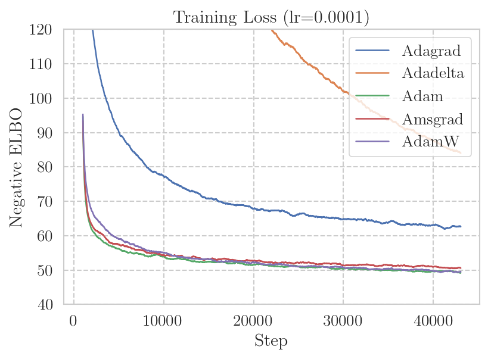
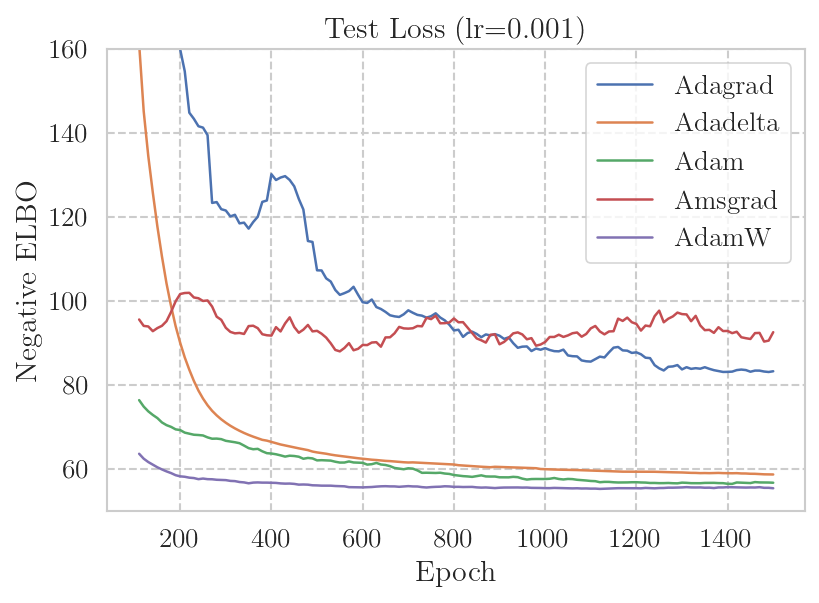

# Optimizers - Week 4 Group 2

## Tiny ImageNet Experiments

### **Dataset**

Tiny ImageNet contains 100,000 images of 200 labels, with 500 images per class. These images were downsized to 64 x 64 images, with every class having 500 training, 50 validation, and 50 test images.

**Source**: [Tiny ImageNet Visual Recognition Challenge](http://cs231n.stanford.edu/reports/2015/pdfs/yle_project.pdf), Ya Le and Xuan Yang

### **Code Structure**

The code needed to perform the same experiments on the TinyImageNet Dataset can be found in both ``./notebooks/TinyImageNet_Experiments.ipynb`` or 
``./src/tiny_imagenet_experiments/TinyImageNet_Experiments.ipynb``. The code for loading the data, processing the data, loading the model, and the training code are located in this notebook.

### **Commands to Run the Code**

The code for the experiments is located in an ``.ipynb notebook`` that was created and run on Google Colab. The easiest way to run this code is to open it on colab where most of the required libraries are already installed as a part of the environment. 

However, outside of colab, the best approach would be to create a python virtual enironment and install the following packages using pip:

* jupyter notebook
* torch
* matplotlib
* tabulate
* torchvision

### **Task**

Use ResNet-50 for Image Classification. 

### **Model Architecture**

We decided to use a pre-defined Residual Network for this image classification task. Specifically, we used a ResNet-50 architecture that was loaded from ``torchvision.models``. This model is predominantly made up of convultional blocks, skip connections, and a ReLU non-linearity totalling to 50 layers. There are other variants of this architecture that have fewer or more layers such as ResNet-34 or ResNet-101 respectively. For our purposes, the final linear layer for ResNet-50 was changed to have 200 out_features as opposed to the default 1000 to fit the needs of the dataset. 

**Source** : [Deep Residual Learning for Image Recognition](https://arxiv.org/pdf/1512.03385.pdf)

### **Conducted Experiments**

The goal is to compare different optimizers on the same task and model architecture. The 5 Optimizers that we compare are:
* **Adagrad** - [Adaptive Subgradient Methods for Online Learning and Stochastic Optimization](https://jmlr.org/papers/v12/duchi11a.html), Duchi, Hazan, Singer; 2011
* **Adadelta** - [ADADELTA: An Adaptive Learning Rate Method](https://arxiv.org/abs/1212.5701), Zeiler; 2012
* **Adam** - [Adam: A Method for Stochastic Optimization](https://arxiv.org/abs/1412.6980), Kingma, Ba; 2014
* **AMSGrad** - [On the Convergence of Adam and Beyond](https://arxiv.org/abs/1904.09237), Reddi, Kale, Kumar; 2019
* **AdamW** - [Decoupled Weight Decay Regularization](https://arxiv.org/abs/1711.05101), Loshchilov, Hutter; 2017

We conducted 4 Experiments on this Dataset:
1. Compare the training loss vs epoch for each optimizer
1. Compare robustness to learning rate for each optimizer
1. Compare the effect of momentum for Adam, AMSGrad, and AdamW
1. Compare the effect of different weight decay values for Adam and AdamW

These experiments were run on a GPU allocated by Google Colab. The overall accuracy of each optimizer, its convergence, and response to different hyparameters were the core idea of our experiments.

Since the model we used was very deep and batch size was large, each epoch was very long, and a lot of training occuring during a single epoch. After about 8 epochs, the model began overfitting and performance on the test set and validation set deteriorated. This phenonomenon occurred regardless of which optimizer was used. In our experiments, there were 2 hyperparameters that remained constant - ```batch size = 128``` and ```number of epochs = 8```. For the training set, we used 200 batches of 128 images, the validation set was 50 batches, and the test set was 100 batches. Therefore, the sizes of the training, validation, and test sets was 25600, 6400, and 12800 images respectively. The images were shuffled prior to being grouped into batches.

### **Results**

#### *Training Loss over Epochs for Each Optimizer*


The ResNet-50 model architecture was run for 8 epochs with a ``learning rate = 1e-2``, ``momentum = 0.9``, and ``weight decay = 1e-6`` as these seemed like appropriate baseline hyperparameter values. The optimizer that performed the worst was Adadelta which did not train at all under the given number of epochs. The same optimizer and model was run for 10 and 15 epochs with no significant drop in training loss or increase in test accuracy. Adagrad performed slightly better than Adadelta and show similar behavior where after 8 epochs where it began to overfit. However, unlike Adadelta, Adagrad was actually able to train the model. Lastly, Adam, AMSGrtad, and AdamW all had almost the exact same training loss curve in the above graph with training loss values being extremely close to each other. Unlike the other 2 optimizers, Adam and its variants were able to properly converge from a high loss value to a relatively low loss value.

It seems apparent that with the baseline hyperparameters, Adam, AMSGrad, and AdamW optimizers trained significantly better than Adagrad and Adadelta. This type of behavior is expected because Adam and its variants are more recent and address the flaws in Adagrad and Adadelta. Despite the similar loss curve, their test accuracies were not the same for Adam, AMSGrad, and AdamW.

#### *Effect of Learning Rate on Performance*


For this experiment, ``momentum = 0.9`` and ``weight decay = 1e-6`` was fixed. The test accuracy for each optimizer at a different learning rate is plotted. The learning rates that were tested were ```1e-1, 1e-2, 1e-3, and 1e-4```. Like the previous experiment, Adadelta performed poorly regardless of the learning rate that was used. We even tried large learning rates such as 1 and 10 which led to similar low accuracies. Adagrad was relatively robust to learning rate, as learning rate inreased, the optimizer became more stable. However, it was not as stable as the Adam optimizers. Adam proved to be the least robust among the 3 because it seemed to have the largest dip in accuracy for the smallest learning rate. AMSGrad was slightly more robust than Adam and performed better than it overall. The most robust optimizer was AdamW whose test accuracy barely changed despite the changing learning rate. AdamW led to the best results in this experiment across all the optimizers. 

#### *Effect of Momentum on Performance*


This experiment was conducted with Adam, AMSGrad, and AdamW optimizers.

For this experiment, ```learning rate = 1e-2 and weight_decay = 1e-6``` was kept constant. We varied momentum and used values ``0, 0.5, 0.9, and 0.99``. From the chart, it's apparent that varying momentum did not really change performance drastically. For the most part, a momentum of 0.5 and 0.9 led to the best results as that seemed to have been the sweet spot. A momentum of 0.0 had performance comparable to that seen with 0.5 and 0.9, where in some cases there was a slight drop in accuracy. The worst result was achieved with a momentum of 0.99, which led to the lowest accuracy for all three optimizers. Although this dip is not especially significant, it was consistent across all three optimizers. Overall, all three of the optimizers showed robustness to changes in the momentum hyperaparameter.

#### *Effect of Weight Decay on Adam and AdamW*


AdamW is supposed to implement weight decay more correctly than Adam, and thus we wanted to test how changing the weight decay would affect performance for both Adam and AdamW. The ```learning rate = 1e-2 and momentum = 0.9``` were held constant for this experiment. It was interesting to see that increasing weight decay led to better performance on Adam, whereas AdamW accuracy was relatively the same. Across all weight decay values, AdamW outperformed Adam with higher test accuracy values. The typical weight decay value is 1e-6 (this was our baseline value as well). At this setting, AdamW achieved a 2% accuracy increase over Adam. Overall, both were still relatively robust to change in weight decay, but AdamW constantly did better than Adam. 

### **Conclusion**


The above table shows test accuracies for hyperparameters at ``learning rate = 1e-2``, ``momentum = 0.9``, and ``weight decay = 1e-6``. Overall, the most robust optimizers seemed to Adam, AMSGrad, and AdamW. Their accuracies did not differ significantly despite changes to various hyperparameters. Among the three, AdamW clearly seemed to have slightly edged out the other optimizers with its consistently better performance and learning across all the experiments conducted. Using the Adadelta optimizer for this task led to very poor results. We tried to experiment around with the learning rate and number of epochs by increasing them, but the usage of this optimizer still ultimately led to very sub-optimal results with this task. The Adagrad optimizer did not lead to drastically low accuracies such as Adadelta, but it did not come close to the Adam optimizers. With this particular setting, AMSGrad and AdamW both had higher test accuracies compared to Adam. This type of result is to be expected because AMSGrad and AdamW were both intended to address problems with Adam. However, their accuracies were not exactly significantly better than Adam.

The clear-winners in the Tiny ImageNet experiments were the Adam Optimizers. The difference in their accuracies is not too significant from each other which makes it difficult to pick a clear-winner. However, if we had to choose, we would say it is AdamW due to its high performance and overall robustness to hyperparameters such as learning rate, momentum, and weight decay.

----

## VAE Experiments

### **Task and Dataset**

In additional to image and text classification, we decided to compare different optimizers on a generative modeling task.  Specifically, we chose to train and evaluate a Variational Autoencoder [2] trained on the Street View House Numbers (SVHN) dataset [1].

The SVHN dataset is a moderately complex dataset with 32x32 color images of house numbers from Google Street View.  It comes with 73257 training and 26032 test images.  Below are some sample images from the dataset.

  
**Source**: [The Street View House Numbers (SVHN) Dataset](http://ufldl.stanford.edu/housenumbers/)

### **Using the Provided Code**
Our implementation was tested on a Linux machine with NVIDIA RTX 2080 GPUs with CUDA 10.2 and cuDNN 8.0.2.
To reproduce our experiment results, please use the provided Anaconda environment configuration to replicate the environment used for our experiments.
```
# Run the following commands in `src/vae`
conda create -f ./environment.yml
conda activate cs395t

# Train the VAE models
python run.py compare_opts --lrs 5e-5,1e-5,5e-5,1e-4,5e-4,1e-3

# Produce result plots
python run.py plot_train_loss --lrs 5e-5,1e-5,5e-5,1e-4,5e-4,1e-3
python run.py plot_test_loss --lrs 5e-5,1e-5,5e-5,1e-4,5e-4,1e-3
```

### **Model Architecture**
We used a modified version of a simple convolutional VAE architecture by Rui Shu [3].
In the architecture definition below, the parts inside `[...]` represent the shape after each layer.

Encoder architecture:  
```
Input [32x32x3]
    -> Conv 1x1 [32 x 32 x 32 ] -> BatchNorm -> Swish
    -> Conv 3x3 [16 x 16 x 32 ] -> BatchNorm -> Swish
    -> Conv 3x3 [8  x 8  x 64 ] -> BatchNorm -> Swish
    -> Conv 3x3 [4  x 4  x 128] -> BatchNorm -> Swish
    -> Linear   [1024] -> BatchNorm1d -> Swish
    -> Linear   [40]
```

Decoder architecture:  
```
Input [20]
    -> Linear             [4  x 4  x 512] -> BatchNorm -> Swish
    -> TransposedConv 4x4 [8  x 8  x 128] -> BatchNorm -> Swish
    -> TransposedConv 4x4 [16 x 16 x 64 ] -> BatchNorm -> Swish
    -> TransposedConv 4x4 [32 x 32 x 32 ] -> BatchNorm -> Swish
    -> Conv 1x1           [32 x 32 x 3  ] -> Tanh
```

The output of the encoder is split into two 20-dimension vectors and used as the mean/variance of the Gaussian variational posterior.  The output of the decoder is also used as the mean of a Gaussian with fixed identity covariance matrix.

### **Experiment Setup**
We trained a VAE for each `(optimizer, learning rate)` pair to compare various aspects of the optimizers considered.  As with other experiments, we used the following optimizers:
* Adagrad: [Adaptive Subgradient Methods for Online Learning and Stochastic Optimization](https://jmlr.org/papers/v12/duchi11a.html), Duchi, Hazan, Singer; 2011
* Adadelta: [ADADELTA: An Adaptive Learning Rate Method](https://arxiv.org/abs/1212.5701), Zeiler; 2012
* Adam: [Adam: A Method for Stochastic Optimization](https://arxiv.org/abs/1412.6980), Kingma, Ba; 2014
* AdamW: [Decoupled Weight Decay Regularization](https://arxiv.org/abs/1711.05101), Loshchilov, Hutter; 2017
* AMSGrad: [On the Convergence of Adam and Beyond](https://arxiv.org/abs/1904.09237), Reddi, Kale, Kumar; 2019

Each model was trained for 150 epochs using batch size of 256.  We also computed the average loss over the test set after each epoch to see if the model starts is overfitting.  In our results below, we focus on the following metric:
* Negative ELBO: This is the training objective we minimize during training.  It is an upper bound to the negative log-likelihood of the model over the dataset and is the main metric used in the VAE literature to compare different models.

### **Experiment Results**

#### **Training Convergence**

Here we display a plot of training loss measured every 10 steps, smoothed out using moving average with window of 100 values.  

  

As shown in the plot, Adam and AdamW optimizers achieve noticeably faster convergence in training loss.  This trend was consistent across various learning rates we considered: `0.00005, 0.0001, 0.0005, 0.001`.

We also notice that Adadelta, Adam and AdamW exhibit relatively stable training compared to the other two (Adagrad, Amsgrad) with much less fluctuations in the loss curve. 
As expected, however, training stability improves when using a smaller learning rate, e.g. `lr=0.0001` as shown below:

  

#### **Test Set Performance**

We also measured the test set performance of the model after each epoch of training, again smoothed using window size of 10. We do not observe overfitting, and the relative order of the optimizer performance was consistent with the training loss plot from above.

  

#### **Effect of Learning Rate**

TODO


#### **Samples from the Model**

TODO

# Reference
**Any code that you borrow or other reference should be properly cited.**

[1] Yuval Netzer, Tao Wang, Adam Coates, Alessandro Bissacco, Bo Wu, and Andrew Y. Ng. "Reading Digits in Natural Images with Unsupervised Feature Learning." _NIPS Workshop on Deep Learning and Unsupervised Feature Learning, 2011_. ([PDF](http://ufldl.stanford.edu/housenumbers/nips2011_housenumbers.pdf))

[2] Kingma, Diederik P., and Max Welling. "Auto-encoding variational bayes." _arXiv preprint arXiv:1312.6114 (2013)_.  ([PDF](https://arxiv.org/abs/1312.6114))

[3] Rui Shu. "DENSITY ESTIMATION: VARIATIONAL AUTOENCODERS." _http://ruishu.io/2018/03/14/vae/_. ([Webpage](http://ruishu.io/2018/03/14/vae/))