# Multi-Label Text Classification on EURLex-4K
## TL;DR
* Fine-tuning BERT on large output-space is brittle and seems to work only in some sweetspot of hyperparameters
* Adam and its variants perform the best with learning rate around ```1e-4```
* AdamW works better than Adam when using weight decay during training

## Running the Code
``` bash
pip install -r requirements.txt
python eurlex-train.py
```

## Setup
### Dataset
For this experiment we used the EURLex-4K dataset which is a widely used [eXtreme Multi-label classification](http://manikvarma.org/downloads/XC/XMLRepository.html) dataset. It contains a collection of documents about European Union law and each document is labelled with multiple tags from a set of about 4000 tags. The dataset was downloaded from [here](https://drive.google.com/open?id=1iPGbr5-z2LogtMFG1rwwekV_aTubvAb2). Following are some statistics of the dataset : 

Num training points | Num labels | Num test points | Avg training points per label | Avg labels per training point
:------------------:|:------------------:|:------------------:|:------------------:|:------------------:
15449 | 3801 | 3865 | 21.64 | 5.32

### Model and Training
The model consists of a [`DistilBERT`](https://huggingface.co/distilbert-base-uncased) feature encoder followed by a `dropout` layer and a `768x3801` fully connected linear layer. The Model is trained on the widely used Binary Cross Entropy Loss (`nn.BCEWithLogitsLoss` in PyTorch)

The learning curves along with the test Precision@1 is compared for following optimizers when trained for 25 epochs
* [Adagrad](https://jmlr.org/papers/v12/duchi11a.html)
* [Adadelta](https://arxiv.org/abs/1212.5701)
* [Adam](https://arxiv.org/abs/1412.6980)
* [Adam with AMSgrad](https://arxiv.org/abs/1904.09237)
* [AdamW](https://arxiv.org/abs/1711.05101)

## Experiments
### Best Results Comparison
Here we plot the best results obtained for each optimizer. Adam and AdamW perform the best and are comparable in terms of the final numbers obtained while Adam with AMSgrad performs slightly inferior to them. Adagrad and Adadelta fail to optimize the model on this task.

<p align="center"> 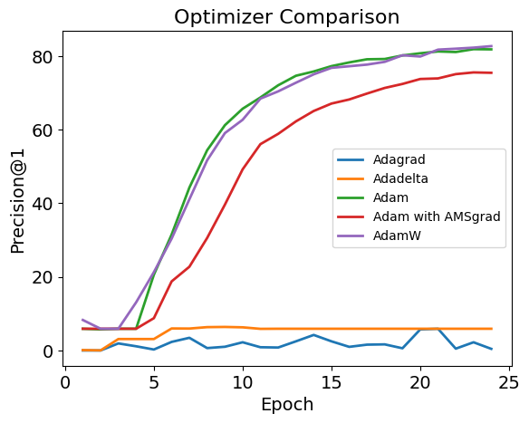 </p>
<p align = "center"> Fig.1 - Adam and its variants perform the best whereas Adadelta and Adagrad fail to train</p>

### Comparison w.r.t Learning Rate
Here we compare the loss curves along with the test Precision@1 for all optimizers with different learning rates. For each optimizer we multiply its default learning rate with a multiplicative factor from `[10, 1, 0.1, 0.01, 0.001]` and then choose that learning rate for a particular run. Default learning rate for Adam and it's variants is `0.001`, for Adadelta is `0.01` and for Adagrad is `1`. Adadelta and Adagrad fail to train across all tried learning rates but Adam and it's variants manage to train the model at `LR=1e-4`. 

Optimizer           | Loss                                                              |  Test Precision@1
:------------------:|:-----------------------------------------------------------------:|:----------------------------------------------------------------:
Adagrad             | 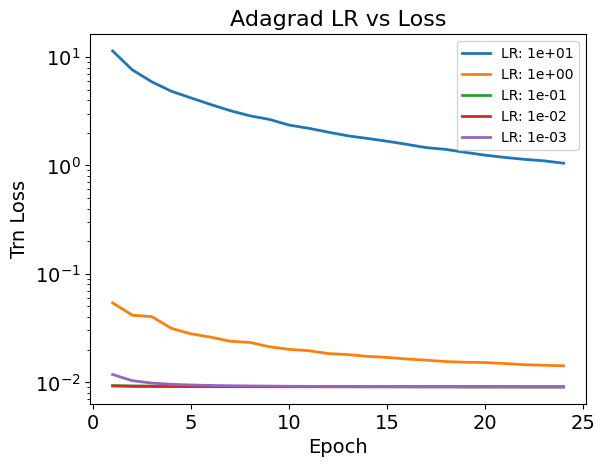            |  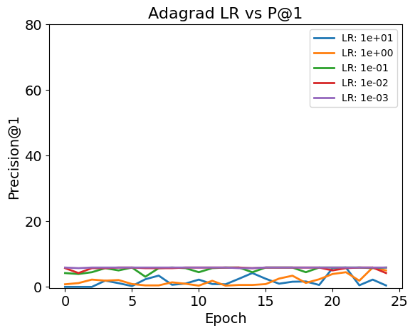
Adadelta            | 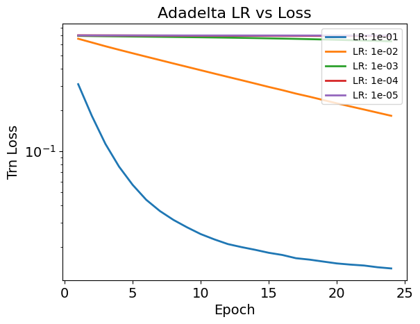           |  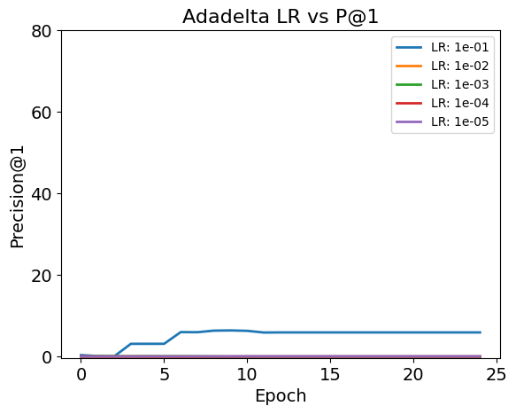
Adam                | 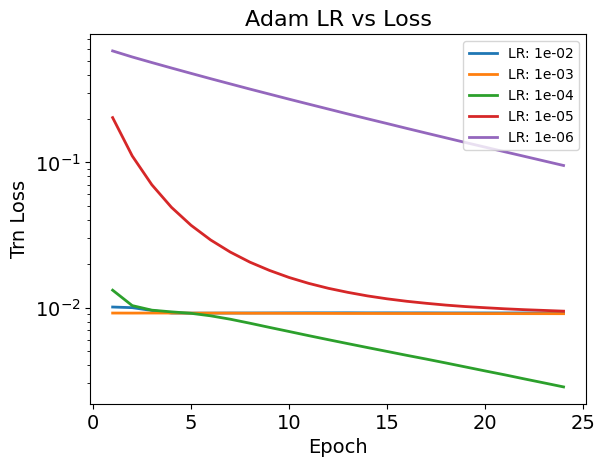               |  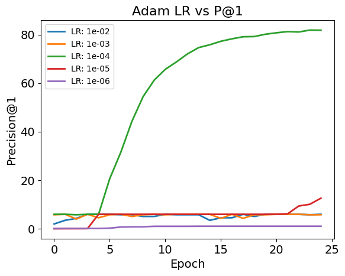
Adam with AMSgrad   | 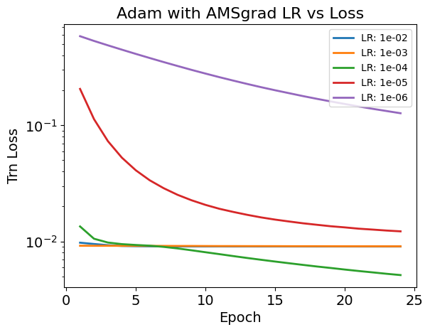  |  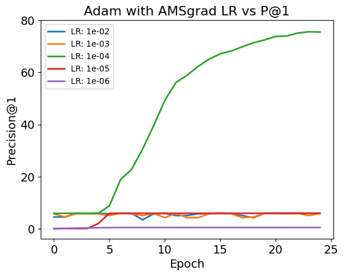
AdamW               | 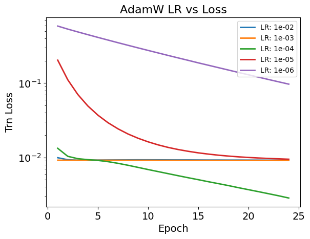              |  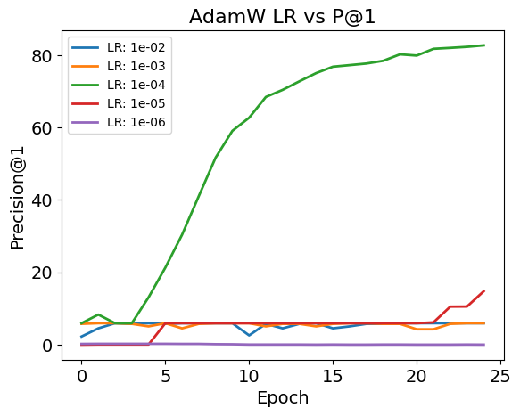

### Comparison of Adam vs AdamW w.r.t. Weight Decay
Here we compare the test Precision@1 for Adam and AdamW with different weight decays. For the same learning rate, we observe that Adam fails to train for non-zero weight decay while AdamW doesn't suffer from any such problem. It's worth noting that weight decay seems to play no significant effect on the final results obtained which might be happening because of already present heavy regularization from dropout (both in DistilBERT and just before fully connected linear layer).

Adam                                                            |  AdamW
:--------------------------------------------------------------:|:---------------------------------------------------------------:
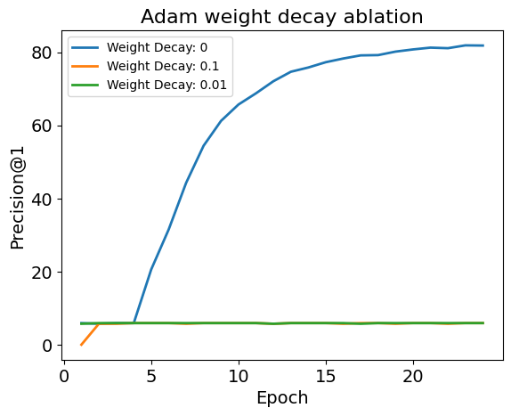  |  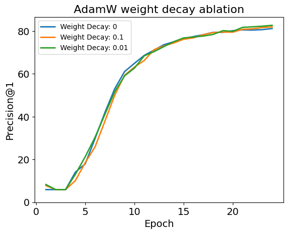

## Discussion
It seems that during most of the failed runs, the DistilBERT model is representing all the documents to a single point in the vector space and then the best the final classifier layer can do is assign the fixed point to the most frequently occuring label in the training dataset. This is shown in following attention heat maps of different layers after a failed training.

`Layer 0` | `Layer 1` | `Layer 2` | `Layer 5`
:-------:|:--------:|:--------:|:-------:
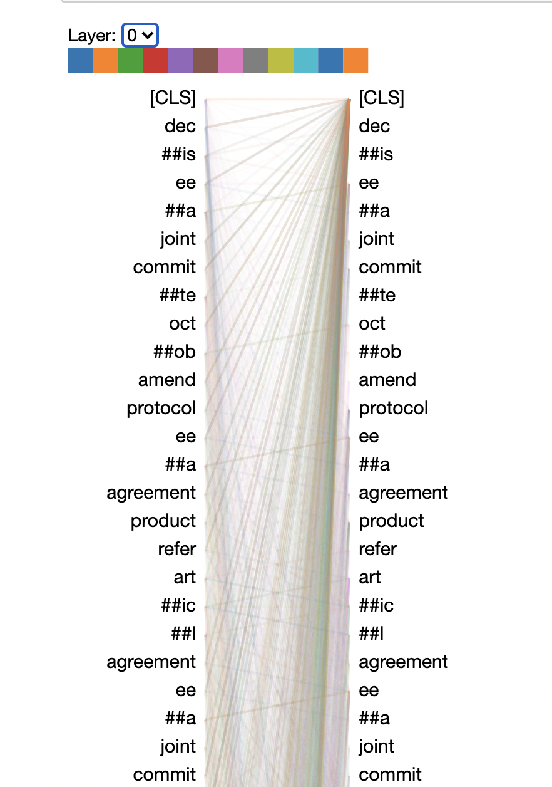 | 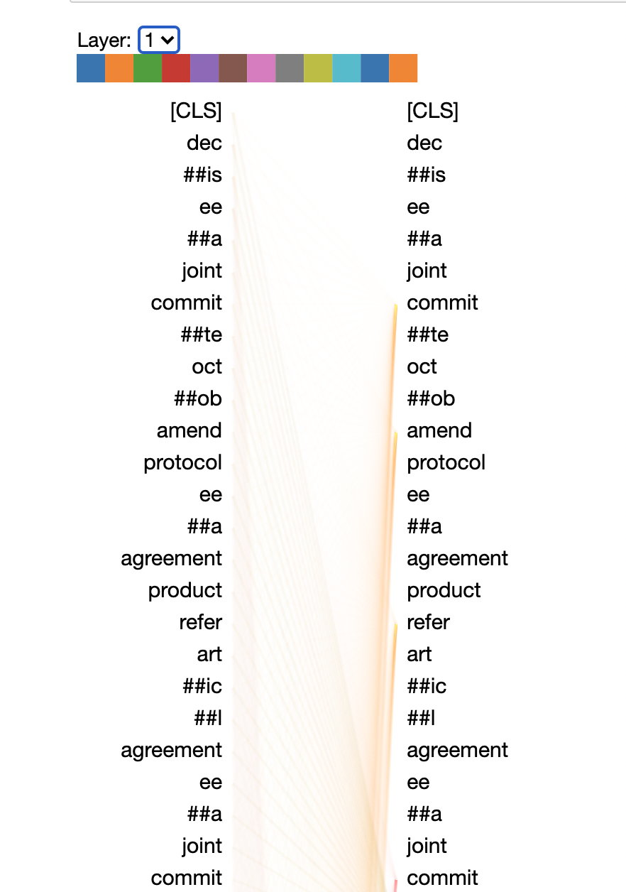 | 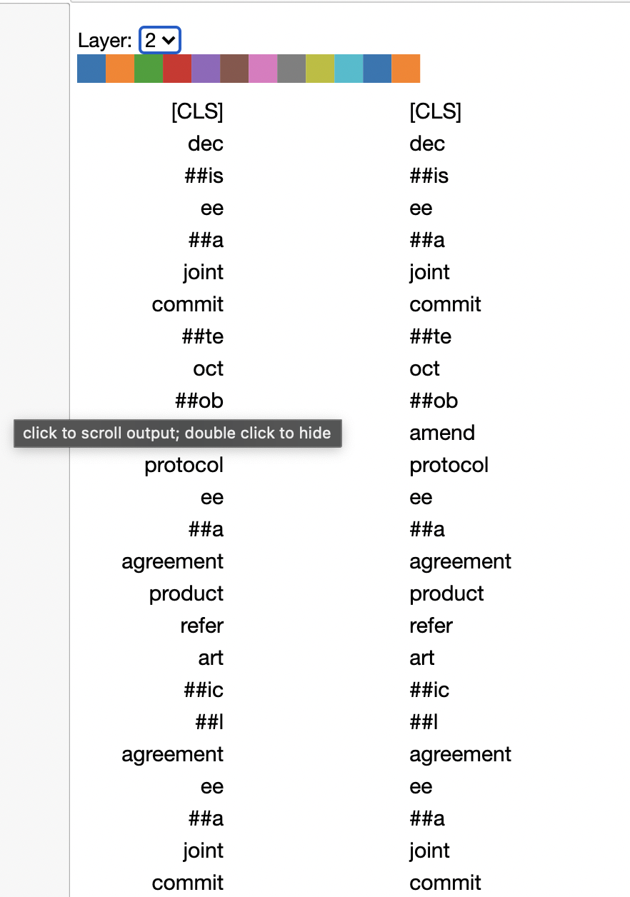 | 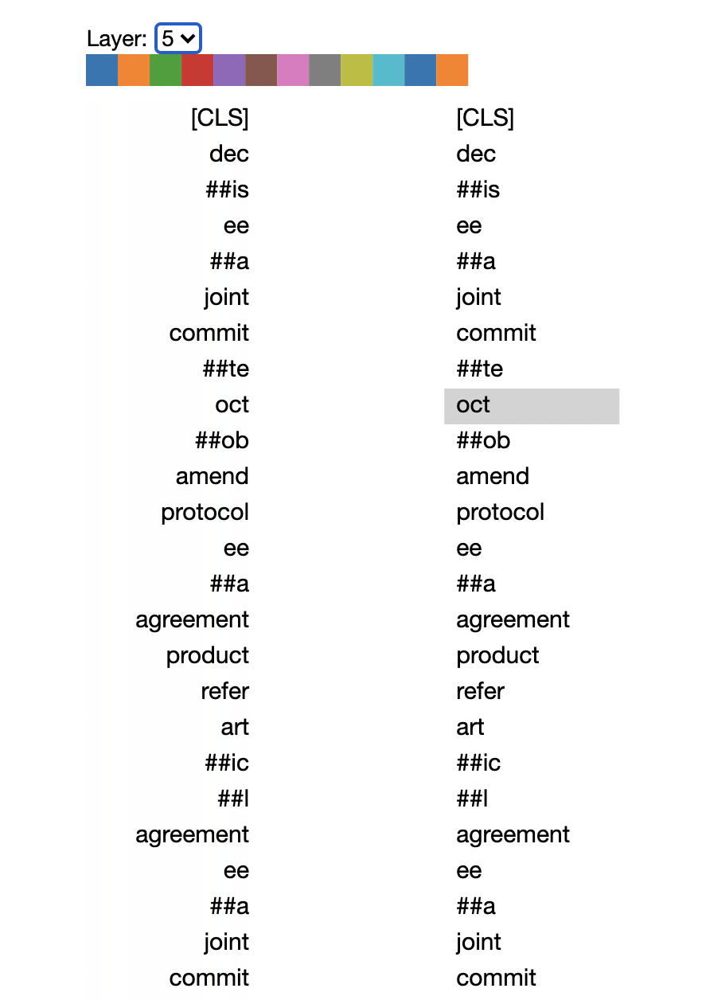
